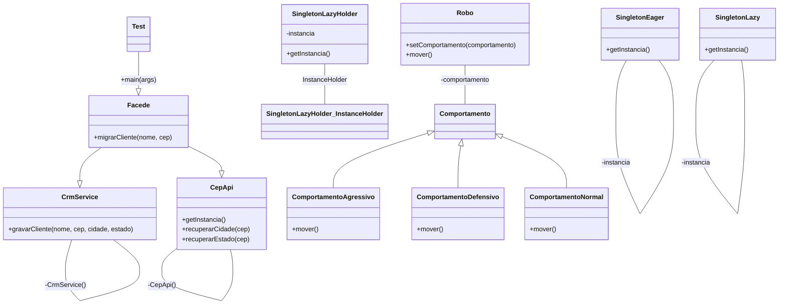

# lab-padroes-projeto-java

Repositório para armazenar os desafios do curso de Java Avançado da DIO.

[Desafio Padrões de Projetos na Prática com Java] - Projeto desenvolvido como parte do desafio Padrões de Projetos na Prática com Java puro, padrões utilizados Singleton,Strategy e Facade.

[Observações] - Projeto para fins de aprendizado.

